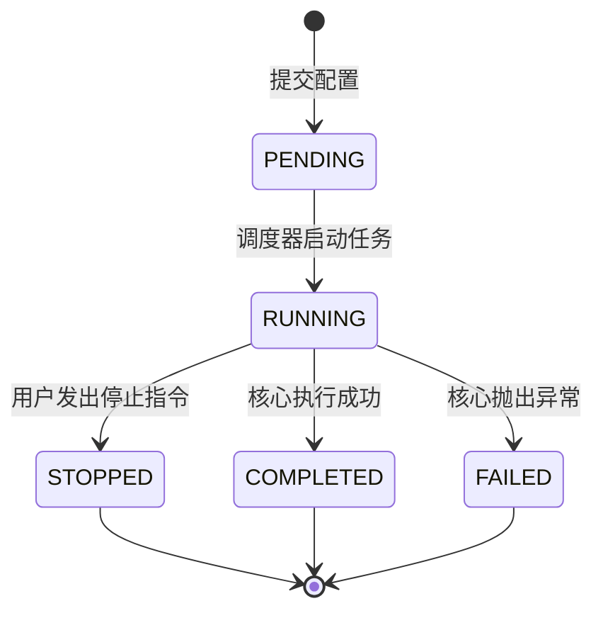

# Tricys Backend 规格说明书 (Specification)

## 1. 术语定义 (Definitions)

| 术语 | 定义 |
| :--- | :--- |
| **Task (任务)** | 用户提交的一次完整的计算请求，对应一个 `config.json`。可能包含一次 Basic Simulation 或一次 Analysis Sweep（内含成百上千个 Job）。 |
| **Job (作业)** | 仿真中的最小计算单元。例如参数扫描中的某一个特定参数组合的计算。 |
| **Workspace (工作区)** | 为每个 Task 分配的独立文件系统目录，用于存放输入 Config、临时文件和输出 Results。 |
| **Backend** | 本次设计的 RESTful API 服务端。 |
| **Core** | 现有的 `tricys` Python 包核心逻辑 (`simulation.py`, `simulation_analysis.py`)。 |

## 2. 用户故事 (User Stories)

### US-01: 提交仿真
*   **作为** 用户
*   **我想要** 选择一个 Modelica 模型，自动获取其可配置参数表单，修改并提交仿真
*   **以便** 无需手动编写 JSON 即可快速启动实验。

### US-06: 动态模型解析 (New)
*   **作为** 用户
*   **我想要** 上传或指定一个 `.mo` 库文件，系统能自动解析出其中的模型列表和参数定义
*   **以便** 在界面上直观地查看和配置模型。

### US-07: BI 工具集成 (New)
*   **作为** 高级用户
*   **我想要** 使用 Grafana 直接连接 Tricys Backend 数据源
*   **以便** 创建自定义的监控仪表盘，实时查看仿真关键指标。

### US-02: 实时监控
*   **作为** 用户
*   **我想要** 实时看到滚动的日志流和进度条
*   **以便** 确认仿真正在正常进行，没有卡死或报错。

### US-03: 任务终止
*   **作为** 用户
*   **我想要** 在发现配置错误时立即停止任务
*   **以便** 节省计算资源。

### US-04: 结果下载与预览
*   **作为** 用户
*   **我想要** 在任务完成后打包下载所有结果，或者在线预览关键指标图表
*   **以便** 在本地进行存档或快速验证结果准确性。

### US-05: 历史查询
*   **作为** 用户
*   **我想要** 查看过去提交的任务列表及其状态
*   **以便** 回溯实验记录。

## 3. 系统特性 (System Features)

### 3.1 任务生命周期管理 (Task Lifecycle)
系统必须维护每个任务的状态机：

### 3.2 文件管理系统
*   **输入**: 支持 JSON 文本直接提交，也支持上传文件。
*   **输出**: 任务目录需严格隔离，格式为 `workspaces/{date}/{task_uuid}/`。
*   **日志持久化**: 
    *   实时日志通过 WebSocket 推送。
    *   全量日志必须写入 `workspaces/.../simulation.log`，供历史回溯。
*   **清理**: 提供定期清理旧任务文件（如保留 7 天）的策略配置。仅保留 HDF5 和 Config，删除过程临时文件。
*   **文件浏览**: (New in Stage 6) 提供 API 递归列出 `Task Workspace` 下的所有文件和文件夹，支持查看元数据（大小、修改时间）。
*   **流式传输**: (New in Stage 6) 实现 `StreamingResponse`，支持断点续传，确保下载 10GB+ HDF5 文件不仅不占用后端内存，且支持暂停/恢复。

### 3.3 数据服务
*   **HDF5 查询引擎**:
    *   支持按 Variable Name、Job ID、Time Range 进行切片查询。
    *   返回格式优化为紧凑的 JSON Structure `{"time": [...], "values": [...]}`。
    *   (New in Stage 6) **Metrics Summary**: 直接从 HDF5 的 `/summary` 表读取预计算指标，用于快速概览。
*   **BI 集成**: (New in Stage 7) 提供兼容通用 BI 工具（如 Grafana JSON Datasource）的查询通过接口。

### 3.4 通知服务
*   基于 WebSocket 的 Pub/Sub 模型。
*   Channel 设计: `/ws/task/{task_id}`。
*   消息类型: 
    *   `LOG`: 纯文本日志行。
    *   `PROGRESS`: JSON 对象 `{"current": 10, "total": 100}`。
    *   `STATUS`: 状态变更通知。

## 4. 关键逻辑规格 (Logic Specifications)

### 4.1 并发控制策略
*   **单机版 (v1.0)**: 为了保证 OpenModelica 的稳定性，同一时间全局只能有一个 `RUNNING` 状态的任务。后续提交的任务进入 `PENDING` 队列。
*   **队列机制**: FIFO (First In First Out)。

### 4.2 错误处理
*   若 Core 进程非正常退出（Exit Code != 0），Backend 必须捕获 stderr 并标记任务为 `FAILED`，同时将错误信息写入 Task Summary。

## 5. 约束条件 (Constraints)
*   **环境依赖**: Backend 运行环境必须预装 Tricys 及其依赖（OpenModelica, Git 等）。
*   **存储**: 依赖本地文件系统存储 HDF5 和日志，暂不引入对象存储（S3）。
*   **鉴权**: v1.0 版本暂不包含用户鉴权 (AuthN/AuthZ)，假设部署在受信的内网环境。
